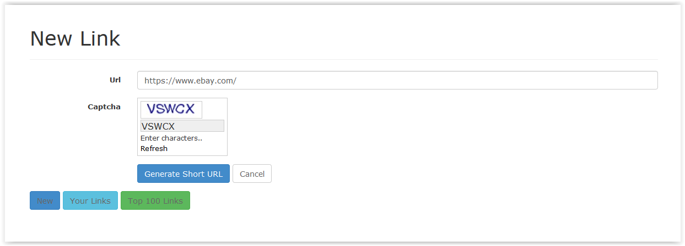

## How to Use
* Open https://amit-mini-url.herokuapp.com/ in browser.
    It will show:
    

* Click on New button. It will open New link form. Enter the URL which you want to convert to short URL. Enter Captcha text. And Click on "Generate Short URL" button.
    

* It will show success message with Your URL and Short URL. Click on Short URL you will redirect to actual URL.
     
    
* In this way you can add multiple urls and generate short url for it.
